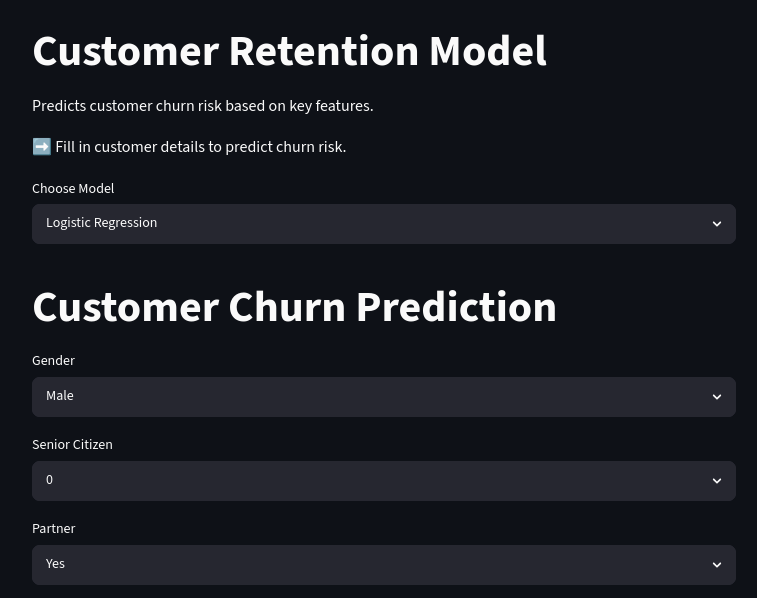

# 📊 Churn Predictor – Interactive Machine Learning Application

## 🚀 Overview

Churn Predictor is an interactive web application built with Streamlit that allows users to estimate customer churn risk in real time using a trained machine learning model.

The application was designed to bridge the gap between machine learning development and practical business usage by providing an accessible interface for testing customer scenarios and understanding churn predictions.

## 🎯 Project Goals

* Deploy a trained machine learning model in an interactive environment.
* Enable real-time churn risk assessment.
* Demonstrate how customer attributes influence prediction outcomes.
* Showcase the practical application of machine learning beyond model training.

## 🔍 Key Features

* Interactive Streamlit user interface.
* Real-time churn probability predictions.
* Binary churn classification (Churn / No Churn).
* Automated preprocessing and feature alignment.
* Custom classification threshold optimized for business-oriented churn detection.
* User-friendly testing of different customer scenarios.

## 🧠 Machine Learning Model

The application uses a Logistic Regression model with L1 regularization trained on the Telco Customer Churn dataset.

### Model Performance

📈 ROC AUC: ~0.86

🎯 Recall (Churn): ~0.68

⚖️ Custom threshold tuning applied to improve churn detection performance.

The model was selected for its strong balance between predictive performance and interpretability, allowing business stakeholders to better understand the factors influencing customer churn.

## 💡 Business Value

Customer churn prediction is most valuable when it supports proactive retention strategies.

This application demonstrates how machine learning can help businesses:

* Identify customers at risk of leaving.
* Prioritize retention campaigns.
* Explore how customer characteristics influence churn risk.
* Support data-driven decision-making.

Rather than focusing solely on model accuracy, the project emphasizes actionable insights and practical business outcomes.

## 🛠️ Tech Stack

* Python
* Streamlit
* Scikit-learn
* Pandas
* NumPy
* Joblib

## 📚 What I Learned

* Deploying machine learning models as interactive applications.
* Building user-friendly interfaces for non-technical users.
* Integrating preprocessing pipelines into production workflows.
* Translating model outputs into business-oriented insights.
* Applying threshold tuning to align model behavior with business objectives.

## 🔥 Key Takeaway

Machine learning is not only about building models—it is about turning predictions into decisions.

**Created on 07.05.2026**

<a href="https://churn-predictor-interactive-ml-app-cnk4xjxwhnvhhzaaohnkns.streamlit.app/" class="md-button md-button--primary">Live Demo</a>
 
 
<a href="https://www.kaggle.com/code/emineyetm/telco-customer-churn/input" class="md-button md-button--primary">Ogrinal data set</a>
<a href="https://www.kaggle.com/emineyetm" class="md-button md-button--primary">Author of dataset</a>
<a href="https://krzysztofzakrzewski.github.io/portfolio/Telco_Customer_clasyfication_EDA/" class="md-button md-button--primary">Previus EDA Analis</a>
<a href="https://krzysztofzakrzewski.github.io/portfolio/Telco_Customer_clasyfication_ML/" class="md-button md-button--primary">ML Process</a>
<a href="https://github.com/KrzysztofZakrzewski/Churn-Predictor-Interactive-ML-App" class="md-button md-button--primary">GitHub</a>
 
 
<a href="clasyfication_model/churn_model_final.pkl" download class="md-button md-button--primary">Download LR Model</a>
<a href="clasyfication_model/gradient_boosting_model.pkl" download class="md-button md-button--primary">Download GB Model</a>

