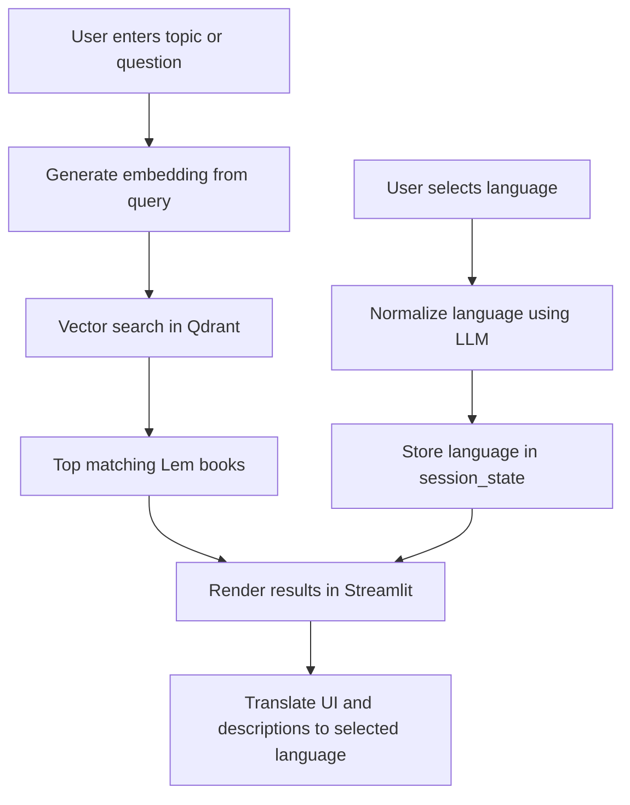

# LemLibrary – application based on embeddings and a Qdrant memory base

At some point, you have to create something for yourself — something for the spirit.

LemLibrary is a project created out of a passion for the works of Stanisław Lem. As a fan of his books, I built an interactive “lemotek” that uses embeddings and semantic search to help users discover Lem’s works based on topics, questions, and their interests.

The library currently includes 20 titles, but I believe anyone interested will find something for themselves.

This project is also a kind of tribute to Stanisław Lem.

The library currently contains 20 titles, but I believe fans of Lem will still find
something interesting to explore.

## Features

- Semantic search for Stanisław Lem books
- Book recommendations based on user topics and questions
- Dynamic translation of the interface and descriptions using an LLM
- Book covers and descriptions displayed in the results

## Tech Stack

streamlit==1.54.0
python-dotenv==1.2.1
openai==2.14.0
qdrant-client==1.15.1

## Requirements

The project requires **Conda** to manage the Python environment.

## Run Locally

Clone the repository and run the application using Conda:

```bash
conda create -n lemlibrary python=3.11
conda activate lemlibrary

pip install -r requirements.txt

streamlit run app.py
```

## How it works



<a href="https://shark-app-2xv8i.ondigitalocean.app/" download class="md-button md-button--primary">Web App link</a>
<a href="https://github.com/KrzysztofZakrzewski/lembrary" download class="md-button md-button--primary">GitHub (main- local)</a>

## Stanisław Lem


English: Stanisław Lem in 1966

Sorce: https://commons.wikimedia.org/wiki/File:St_Lem_resize.jpg

Author:	Courtesy of Lem's secretary, Wojciech Zemek. Resize and digital processing by Masur.

(1921–2006) was one of the most outstanding science fiction writers of the 20th century, as well as an essayist, futurologist and philosopher. He was born in Lviv and, after World War II, settled in Kraków, where he spent most of his life. His work combined scientific imagination, sharp satire and deep reflection on the nature of humanity, technology and the future of civilization.

Lem is the author of such works as Solaris, The Cyberiad, The Fables of Robots, The Star Diaries and Tales of Pirx the Pilot. His books have been translated into more than 40 languages, with total sales exceeding 45 million copies, making him the most widely translated Polish author.

A characteristic element of his style was intelligent humor, grotesque imagery, irony and philosophical provocation. Lem used science fiction not only to imagine the future, but above all to critically comment on the modern world, human weaknesses and the limits of human knowledge.

To this day he remains one of the most important and original figures in world science fiction literature, and his works continue to inspire scientists, philosophers, programmers and artists around the globe.

**Created 8.03.2026**

<script>
function resizeIframeToFitContent(iframe) {
    iframe.style.height = (iframe.contentWindow.document.documentElement.scrollHeight + 50) + "px";
    iframe.contentDocument.body.style["overflow"] = 'hidden';
}
window.addEventListener('load', function() {
    var iframe = document.getElementById('content');
    resizeIframeToFitContent(iframe);
});
window.addEventListener('resize', function() {
    var iframe = document.getElementById('content');
    resizeIframeToFitContent(iframe);
});
</script>