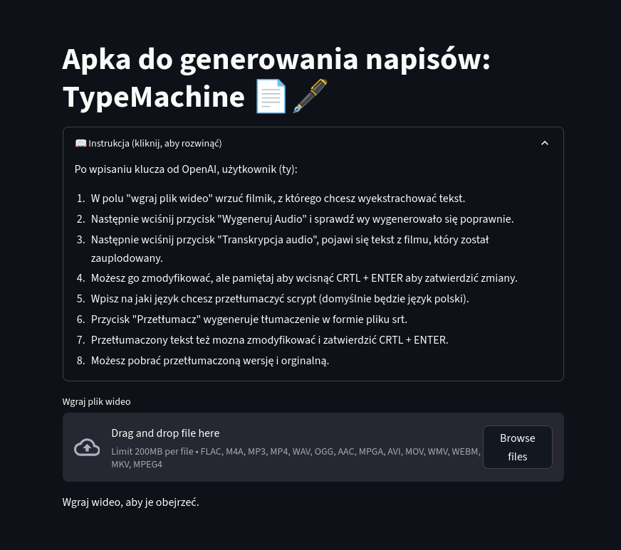
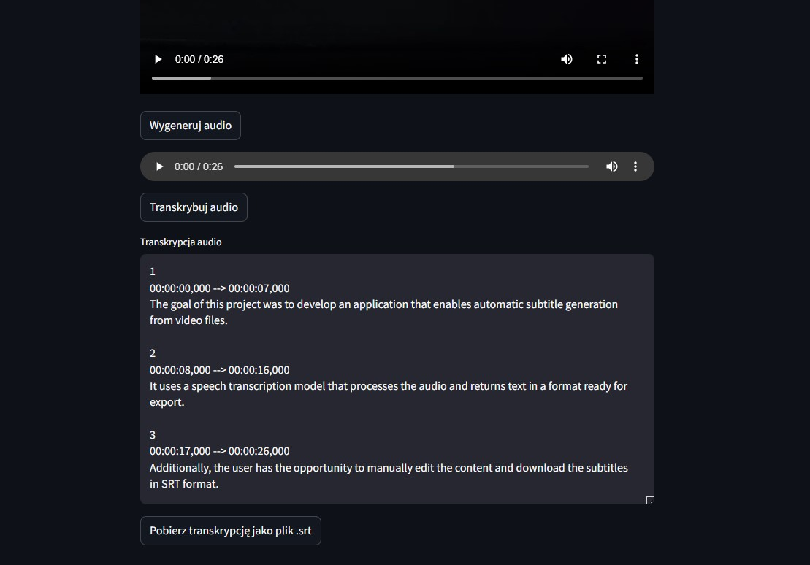

# Simple app for generating texts: TypeMachine 📄🖋️

### Description

It uses OpenAI’s "whisper-1" model to generate subtitles from mp3 files extracted from videos.
Due to technological limitations, the size of the processed video is limited to 200MB.

Have fun!. 🎠

### Description:
1. Select the target translation language by entering its ISO code
2. In the “Upload video file” field, upload the video from which you want to extract text
3. Click the “Generate Audio” button and check if the audio was generated correctly
4. The extracted text from the uploaded video will appear
5. You can edit this text, but remember to press CTRL+ENTER to confirm the changes
6. After clicking the “Download transcription as .srt file” button, the file will be saved to your disk
7. If you don’t want to download a file from an unknown internet source (which is a good practice), you can copy the extracted text to a notepad.txt file and then change its extension to .srt

<a href="http://104.248.47.250:8501/" download class="md-button md-button--primary">Link do aplikacji</a>
<a href="https://github.com/KrzysztofZakrzewski/typemachine/tree/srt" download class="md-button md-button--primary">GitHub</a>

### Mini spec:
1. Python 3.11.11
2. streamlit 1.42.0 py311haa95532_0
3. streamlit-audiorecorder 0.0.6 pypi_0
4. pypi pydub 0.25.1 pyhd8ed1ab_1 conda-forge
5. python-dotenv 0.21.0 py311haa95532_0 
6. openai 1.47.0 pyhd8ed1ab_0 conda-forge 
7. ffmpeg 6.1.1 hc79a5da_2 
8. ffmpeg-python 0.2.0 pypi_0 pypi

### Appearance of the application

