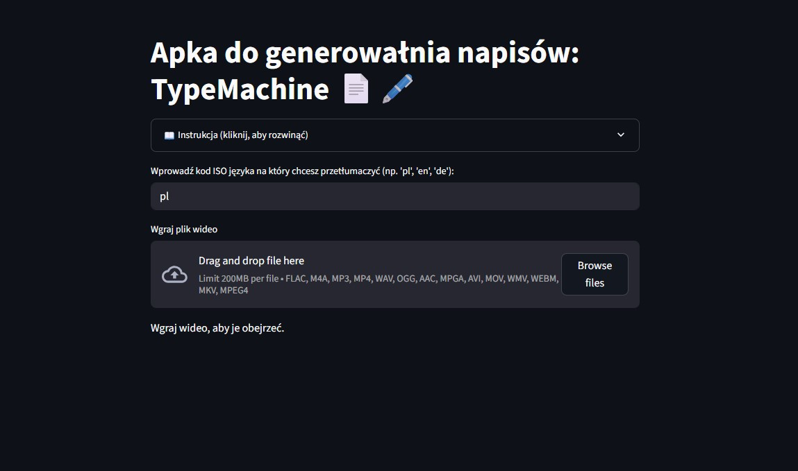

# Prosta Apka do generowałnia napisów: TypeMachine 📄🖋️

### Opis

Wykorzystuje model "whisper-1" od OpenAI do generowania napisów z pliku mp3, wygererowanego z filmów.
Ze względów technologicznych wielkość procesowanego filmu ogranicza się do 200MB.

Miłej zabawy. 🎠

### Instrukcja:
1. Wybierz docelowy język tłumaczenia, wpisując jego kod ISO.
2. W polu „Wgraj plik wideo” załaduj wideo, z którego chcesz wyodrębnić tekst.
3. Kliknij przycisk „Wygeneruj Audio” i sprawdź, czy dźwięk został poprawnie wygenerowany.
4. Pojawi się wyodrębniony tekst z przesłanego wideo.
5. Możesz edytować ten tekst, ale pamiętaj, aby nacisnąć CTRL+ENTER, aby zatwierdzić zmiany.
6. Po kliknięciu przycisku „Pobierz transkrypcję jako plik .srt”, plik zostanie zapisany na Twoim dysku.
7. Jeśli nie chcesz ściągać pliku od nieznanej osoby z internetu (co jest dobrą praktyką), możesz sokpiować wyekstrachowany tekst do notatnika.txt i zmienić roszerzenie na .srt.

<a href="http://104.248.47.250:8501/" download class="md-button md-button--primary">Link do aplikacji</a>
<a href="https://github.com/KrzysztofZakrzewski/typemachine/tree/srt" download class="md-button md-button--primary">GitHub</a>

### Mini scpecyfikacja:
1. Python 3.11.11
2. streamlit 1.42.0 py311haa95532_0
3. streamlit-audiorecorder 0.0.6 pypi_0
4. pypi pydub 0.25.1 pyhd8ed1ab_1 conda-forge
5. python-dotenv 0.21.0 py311haa95532_0 
6. openai 1.47.0 pyhd8ed1ab_0 conda-forge 
7. ffmpeg 6.1.1 hc79a5da_2 
8. ffmpeg-python 0.2.0 pypi_0 pypi

### Wygląd aplikacji

